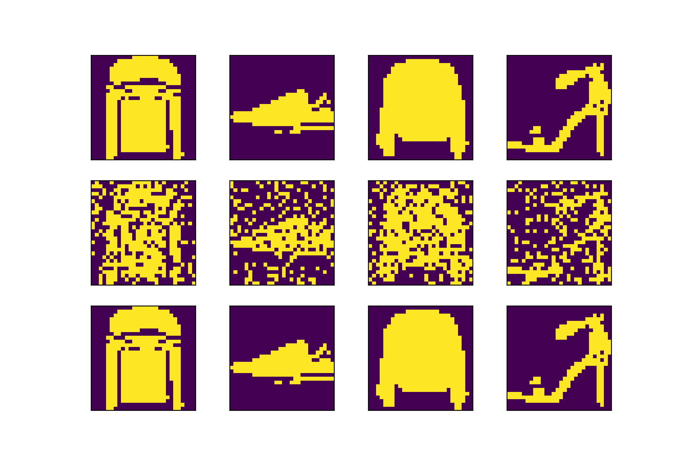
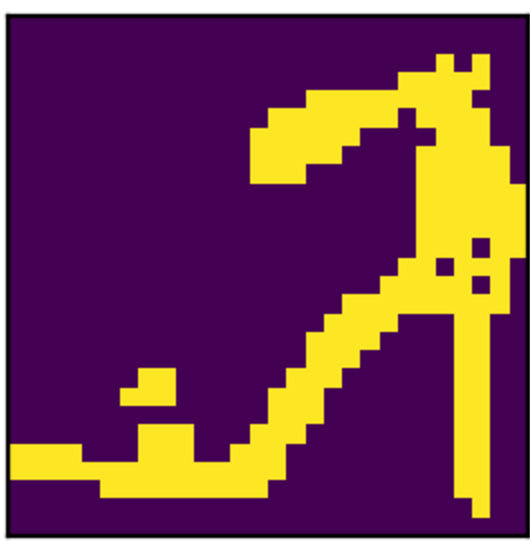
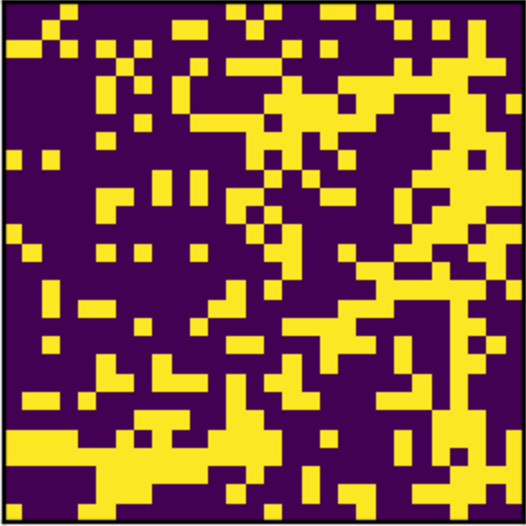

# Welcome to Emergence # 

This is a research library to study the emergent properties of undirected neural networks, including Hopfield networks and Boltzmann machines.

**To read more about Hopfield networks, see the primer I wrote [here](https://soniajoseph.github.io/computational%20neuroscience/neural-dynamics-primer/).**

## Setup

Set up your local environment and install package.

```python
python3 -m venv env
pip3 install -e .
```

See /tests for sample use cases.

## Hopfield Networks



Hopfield networks are fascinating one-shot data-denoisers. We train the network to "remember" the top row of fashion MNIST images using Hebbian learning. The network does not store the actual image, but encodes information of the image in its weights.

Then, we add noise to the image, randomly setting 30% of the pixels to the opposite value. When we feed each random image into the pre-trained Hopfield network, we get the original image back (bottom row)! 

### Example on FMNIST

<table style="width:100%">
  <tr>
    <td><b>Original</b></td>
    <td></td>
  </tr>
  <tr>
    <td><b>Noisy</b></td>
    <td></td>
  </tr>
  <tr>
    <td><b>Reconstructed</b></td>
    <td></td>
  </tr>
</table>

### Use

```python
from emergence.hopfield import Hopfield
from emergence.preprocess.preprocess_image import * 

# Preprocess data
fashion_mnist = keras.datasets.fashion_mnist
(train_images, train_labels), (test_images, test_labels) = fashion_mnist.load_data()
row, col = train_images[0].shape
data = train_images[5:9]
data = [normalize_binarize(i) for i in data]
data = [i.flatten() for i in data]

# Train network
hn = Hopfield()
hn.train(data)

# Get noisy data
noise_data = [noise_image(i, .3) for i in data]

# Run network on noisy data
data_hat = [hn.run(i, 1) for i in noise_data]
```

Run above file
```
python -m emergence.tests.hopfield_fmnist
```

See /tests for more examples.

## Resources
[Hopfield Networks - A Primer](https://soniajoseph.github.io/computational%20neuroscience/neural-dynamics-primer/)

[Neural networks and physical systems with emergent collective computational abilities](https://www.pnas.org/content/79/8/2554)
